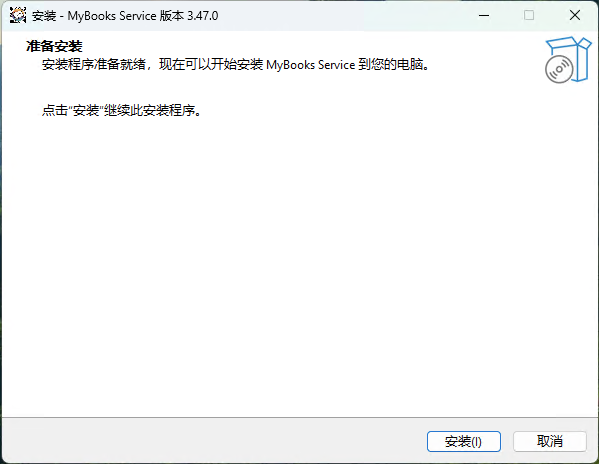
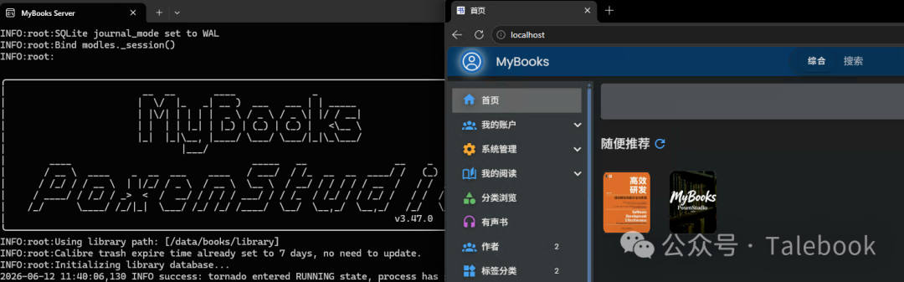

# 常见问题
本文档整理了 MyBooks 使用过程中最常见的问题及其解决方案。如果您遇到的问题未在此列出，请访问 [GitHub Issues](https://github.com/PoxenStudio/MyBooks/issues) 寻求帮助，或者在MyBooks公众号上私信反馈。

## 🚀 部署与安装

### 如何使用 Docker 部署 MyBooks？

最简单的方式是使用 Docker Compose：

```yaml
services:
  MyBooks:
    restart: always
    image: poxenstudio/mybooks
    volumes:
      - /mnt/data/books:/data
    ports:
      - "8080:80"
    environment:
      - PUID=1000
      - PGID=1000
      - TZ=Asia/Shanghai
```

然后运行 `docker compose up -d` 即可。首次访问使用账号 `admin`，密码 `12345678`。

### 端口冲突怎么办？

如果 8080 端口已被占用，可以修改映射端口，例如改为 `8082:80`。左边是主机端口（可以修改），右边是容器内部端口（保持 80 不变）。

### PUID 和 PGID 应该设置为多少？

这两个参数用于设置容器内进程的用户权限，建议设置为您系统中实际用户的 UID 和 GID，可以通过命令查看：

```bash
id -u  # 查看 UID
id -g  # 查看 GID
```

设置正确的 PUID/PGID 可以避免文件权限问题。

### 如何升级到最新版本？

停止容器，拉取最新镜像，重新启动：

```bash
docker compose down
docker compose pull
docker compose up -d
```

数据存储在挂载的卷中，升级不会丢失数据。

## 🖥️Windows安装
自v3.47起提供在Windows 10之后版本上独立的安装程序，不依赖Docker。可以在各个release的附件中下载。


安装后可以会出现```MyBooks Service```程序, 提供停止、重启和卸载操作。
启动后，服务通过本机ip可以访问。


数据目录在当前用户的AppData/Local目录下， 可以直接查看。

* Windows上更新时需要先卸载旧版本，再安装新版本才会生效。


## ⬆️书籍导入

### 为什么扫描导入后看不到书籍？

可能的原因：

- 文件未放在正确的目录（应该是 `/data/books/imports/`）
- 点击了`扫描书籍`但未点击`导入全部书籍`
- 导入任务正在后台执行，刷新页面查看进度
- 文件格式不支持（支持 EPUB、MOBI、AZW3、PDF 等常见格式）

### 导入速度很慢怎么办？

导入是后台异步任务，初次导入大量书籍时可能需要较长时间。您可以：

- 分批次导入，每次几百本
- 关闭浏览器，导入会在后台继续进行
- 在`系统设置`中暂时关闭`自动获取元数据`，导入后再批量更新

### 如何从 Calibre 迁移到 MyBooks？

MyBooks 基于 Calibre开发，完全兼容其库结构：

1. 停止 MyBooks 容器
2. 将 Calibre 的 library 文件夹复制到绑定目录的 `books/` 下
3. 启动容器，所有书籍和元数据自动加载

✅ 迁移后依然可以继续使用 Calibre 桌面端管理。

## 🌟首页调整
首页默认显示的组件较多，包括阅读数据看板、在读书籍、书单推荐、新评书籍和随机推荐。以上各项均可以在系统设置配置关闭或者显示书籍个数(为0表示不显示)：
- `基础信息` - `随机推荐图书数量` 设置0时表示关闭
- `浏览与阅读` - `在首页显示阅读统计Banner` 可以关闭阅读数据看板
- `浏览与阅读` - `在首页显示在读书籍` 可以关闭在读书籍列表
- `浏览与阅读` - `在首页展示其他用户评论过的书籍` 可以关闭新评书籍列表
- `浏览与阅读` - `在首页展示书单推荐` 可以关闭书单推荐更表


## 📝 元数据管理

### 书籍信息不准确，如何更新？

有几种方式：

- **自动更新：** 在`图书管理`中勾选书籍，点击`自动更新信息`
- **手动编辑：** 进入书籍详情页，点击`管理` → `编辑书籍信息`
- **AI 辅助：** 配置 AI API 后，使用`AI更新信息`功能

### 豆瓣刮削失败或无法获取封面？

确保部署了 `douban-rs-api` 服务。在 docker-compose.yml 中添加：

```yaml
services:
  douban-rs-api:
    restart: always
    image: ghcr.io/cxfksword/douban-api-rs
  MyBooks:
    depends_on:
      - douban-rs-api
```

重启后 MyBooks 会自动使用该服务获取豆瓣数据。

### 如何批量修改书籍分类或标签？

在`图书管理`页面：

1. 使用搜索框筛选需要修改的书籍
2. 勾选目标书籍（可全选）
3. 在`管理`→`系统设置`→`分类管理`中设置好分类
4. 回到图书管理页面进行批量操作


## 🔄 格式转换

### EPUB 转 AZW3 失败？

可能的原因：

- 原始 EPUB 文件损坏，尝试用其他工具验证
- EPUB 包含 DRM 保护，需要先去除 DRM
- 容器资源不足，转换大文件时需要更多内存

查看容器日志获取详细错误信息：`docker logs MyBooks`

### 转换后的文件在哪里？

转换后的文件会自动添加到该书籍的格式列表中，在书籍详情页的"下载"区域可以看到所有格式。文件存储在绑定目录的 `books/library/` 对应书籍文件夹下。


## 📤 推送与传输

### 无法推送到 Kindle？

检查以下配置：

1. **SMTP 设置：** 在`系统设置`中正确配置发件邮箱的 SMTP 信息
2. **授权码：** 大部分邮箱不支持直接密码，需要生成专用授权码（如 QQ 邮箱、网易邮箱）
3. **Kindle 邮箱：** 确认 Kindle 接收邮箱地址正确（`xxx@kindle.com` 或 `xxx@kindle.cn`）
4. **白名单：** 在 Amazon 账户管理中将发件邮箱加入"已认可的发件人电子邮箱列表"

💡 使用`测试邮件`功能验证 SMTP 配置是否正确。

### 如何推送到文石/汉王等墨水屏设备？

这些设备通常支持 Wi-Fi 传书：

1. 在设备上开启`Wi-Fi 传书`功能，记录显示的 IP 地址和端口（如 `192.168.1.100:8080`）
2. 在 MyBooks 书籍详情页点击"发送到设备"
3. 输入设备的 IP:端口，选择格式后推送

或者使用 WebDAV 方式直接在设备上挂载书库。


## 🌐 WebDAV

### 如何启用 WebDAV？

在`系统设置` → `高级选项`中开启 WebDAV 功能。WebDAV 地址为：`http://你的IP:端口/books/`

在阅读器或文件管理器中添加 WebDAV 连接，输入地址和 MyBooks 账号密码即可。

### WebDAV 连接不上？

常见问题：

- **路径错误：** 确保 URL 以 `/books/` 结尾
- **认证失败：** 检查用户名密码是否正确
- **HTTPS 问题：** 部分客户端不支持自签名证书，建议使用 HTTP 或配置正式证书
- **防火墙：** 确保端口未被防火墙阻止


## 🎧 有声书

### 有声书转换失败或卡住？

有声书转换需要较多资源，确保：

- 容器分配了足够的 CPU 和内存
- 源文件是 EPUB 格式（不支持 PDF）
- EPUB 内部文本格式正确，没有大量图片干扰

转换可以中断后继续，不必一次性完成。

### 生成的音频文件在哪里？

音频文件保存在绑定目录的 `books/audios/` 子目录下，以书籍ID命名。您可以：

- 在网页内置播放器中收听
- 直接复制音频文件到手机或专业听书软件
- 通过 WebDAV 在移动设备上访问


## 🔒 权限问题

### 文件权限错误，无法读写？

这通常是 PUID/PGID 设置不当导致的。解决方法：

1. 检查绑定目录的所有者：`ls -la /mnt/data/books`
2. 确保 docker-compose.yml 中的 PUID/PGID 与目录所有者一致
3. 或者手动修复权限：`sudo chown -R 1000:1000 /mnt/data/books`

⚠️ 文件权限修复可在"系统设置"中执行，但需要一定时间。

### 访客可以看到所有书籍，如何限制？

在`系统设置` → `用户管理`中：

- 关闭`允许访客阅读`和`允许访客下载`
- 开启`需要激活`选项，手动审核新用户
- 使用`设为私藏`功能将特定书籍设为仅自己可见


## ⚡ 性能优化

### 页面加载缓慢？

优化建议：

- **配置 CDN：** 在`系统设置`中设置 CDN 域名，加速静态资源加载
- **启用封面缓存：** 确保封面正常显示，浏览器会自动缓存
- **数据库维护：** 定期重启容器，清理临时文件
- **减少首页显示数量：** 调整`推荐数量`和`最近显示`配置

### 容器占用资源过高？

正常情况下 MyBooks 资源占用不高。如果异常：

- 检查是否有大量后台任务（导入、转换、刮削）正在执行
- 暂停不必要的自动任务
- 适当增加容器的内存和 CPU 限制
- 查看日志排查异常：`docker logs MyBooks --tail 100`


## 🔧 其他问题

### 忘记管理员密码怎么办？

* 停止容器
* 找到绑定目录下`books/settings/auto.py`, 将其中的`installed: True`改为`installed: False`
* 启动容器，打开MyBooks会提示重新配置管理员密码


### 如何备份书库？

只需备份绑定的数据目录即可（如 `/mnt/data/books`）。该目录包含：

- `library/` - 所有书籍文件和元数据
- `calibre-webserver.db` - 基础数据
- `audios/` - 有声书文件

建议使用 `rsync` 或定期自动备份工具。


### 支持 OPDS 吗？

是的，MyBooks 完全支持 OPDS 协议。在阅读器中添加：

```
http://你的IP:端口/opds/
```

使用 MyBooks 账号密码认证即可。兼容 KyBook、Marvin、FBReader 等主流阅读器。

### 💬 还有其他问题？

- 🌐 项目主页：<https://mybooks.top>
- 🐙 GitHub：[PoxenStudio/MyBooks](https://github.com/PoxenStudio/mybooks)
- 💬 问题反馈：关注
  MyBooks公众号私信
  

