## 📖 为您搭建私有书库

MyBooks(PoxenStudio/Talebook) 是一个专为书籍爱好者打造的一站式私有电子书库解决方案。它集收藏、整理、阅读、转换、同步和智能分析于一体。通过 Docker 部署，您可以在 NAS、服务器或个人电脑上建立完全由自己掌控的数字图书馆。

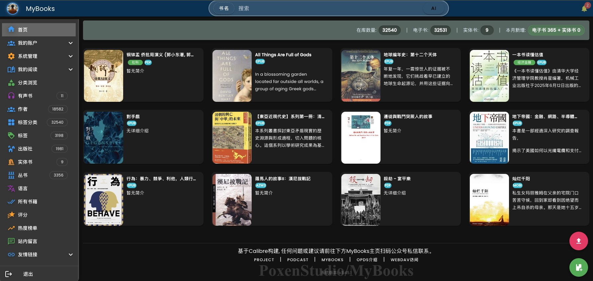

### 为什么选择 MyBooks？

- 🚀 告别繁琐：传统 Calibre 配置复杂，MyBooks 集成元数据刮削，开箱即用。
- 🔄 全链路管理：从获取书籍、整理、推送到有声书生成、AI分析，完整闭环。
- 📱 设备无缝衔接：Kindle、文石、汉王、手机平板，进度同步。
- 🧠 持续智能进化：AI 补全信息，接入知识库，让书库“活”起来。

## 文档目录

- [第一步：建立您的书库](#step1)
- [第二步：让书库信息丰富准确](#step2)
- [第三步：处理电子书格式](#step3)
- [第四步：在您喜欢的设备上阅读](#step4)
- [第五步：聆听您的书籍](#step5)
- [第六步：用AI赋能书库管理](#step6)
- [第七步：提升阅读体验](#step7)
- [第八步：管理实体藏书](#step8)
- [第九步：系统配置与管理](#step9)
- [快速入门与部署指南](#quickstart)

---

## 第一步：建立您的书库

### 开始导入书籍

**使用场景：**下载了一批 AZW3/MOBI/EPUB/PDF，需要整理到 MyBooks 中。

#### 📂 扫描导入（推荐批量）

1. 将文件放到MyBooks绑定目录下 `books/imports/` 子目录。
2. 登录网页 → “管理” → “导入图书” 页面。
3. 点击“扫描书籍”。系统解析文件，顶部显示进度条（如“扫描中 386/10425 (4%)”）。

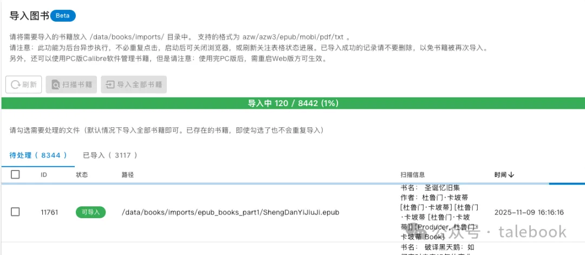

🖼️ 扫描导入界面：进度条与批量导入按钮

4. 扫描完成，点击“导入全部书籍”。后台异步任务，可关闭浏览器稍后查看。

💡 提示：此操作为后台异步任务，启动后可关闭浏览器，稍后回来看结果。

#### 🌐 网页上传（适合单本）

点击右下角“上传”按钮（红色图标）选择文件即可。

### 从现有 Calibre 书库无缝迁移

如果你是 Calibre 老用户：

1. 在 Calibre 中找到书库路径（library 文件夹）。
2. 停止 MyBooks 容器。
3. 将整个 library 文件夹复制到 MyBooks 绑定目录中`books/`下。
4. 启动容器，所有书籍、元数据完整呈现。

📌 基于 Calibre 7.6，格式完全兼容，依然可用 Calibre 桌面端编辑。

### 高效管理：批量操作与搜索

**使用场景：**想快速清理一批书或找出某作者的所有书。

- **图书管理面板：** “管理”→“图书管理”，表格列出所有书籍。
- **批量删除：** 勾选复选框 → “删除选中的图书”。
- **高级筛选：** 输入关键词实时过滤书名、作者、标签。
- **类型转换：** 将电子书/实体书互相标记。

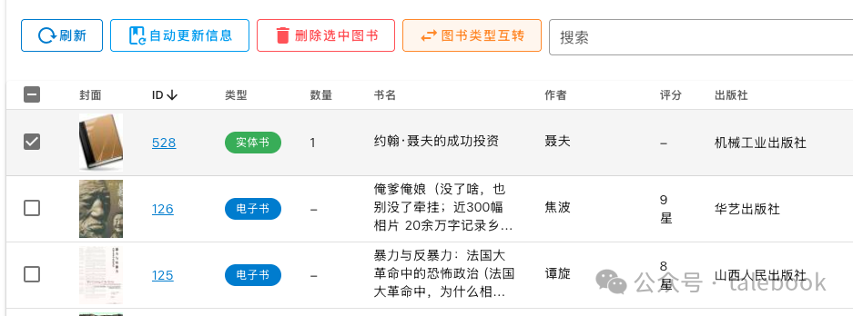

📋 批量管理工具栏：刷新、自动更新信息、删除、图书类型互转、搜索框

---

## 第二步：让书库信息丰富准确

### 自动获取图书元数据（刮削）

导入时自动匹配豆瓣等源；也可在“图书管理”勾选书籍后点击“自动更新信息”。

### 手动更新与精细编辑

在图书详情页 → “管理” → “编辑书籍信息”，修改书名、作者、简介等。

### 使用AI智能补全图书信息

配置 AI API 后，在详情页“管理”中选择“AI更新信息”，可批量或单本调用大模型补全冷门书信息。

### 管理标签与分类体系

自定义分类：“管理”→“系统设置”→“用户管理”中添加分类。在作者/标签页可批量设置分类，支持标签置顶。

### 将元数据写入电子书文件

在详情页“管理”→“同步到书籍文件”，将封面、作者等信息写入 EPUB/AZW3 内部，随处打开都显示正确。

---

## 第三步：处理电子书格式

### 转换格式以适应不同设备

详情页“管理”中“EPUB/KINDLE转换”：EPUB ↔ AZW3，以及导出A5 PDF（用于AI知识库）。

### 管理图书的多种格式文件

下载区域可见所有格式；管理菜单可删除某格式，或将某格式抽出为新书（避免合并错误）。

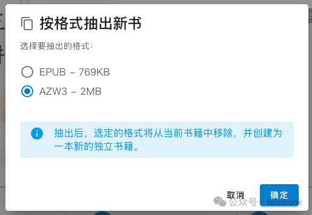

📤 “按格式抽出新书” 功能：选择格式，创建新记录

---

## 第四步：在您喜欢的设备上阅读

### 通过邮箱推送至 Kindle

配置 SMTP 和 Kindle 接收邮箱（`@kindle.com`），在图书详情页点击“发送到设备”。

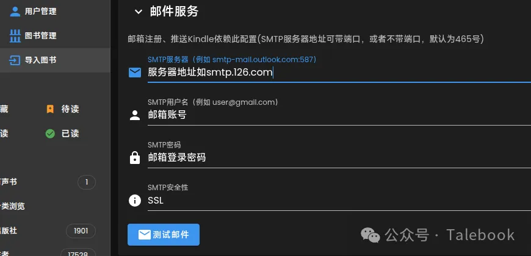

发送邮箱的SMTP配置


Kindle 推送

### 通过局域网无线推送到阅读器

文石/汉王等开启“Wi-Fi传书”，记录IP:端口，在 MyBooks “发送到设备”填入地址即可。

### 通过 WebDAV 像网盘一样访问

启用 WebDAV 后，地址 `http://你的IP:端口/books/`，可用阅读器（文石、Koodo Reader）挂载，同步进度、笔记。

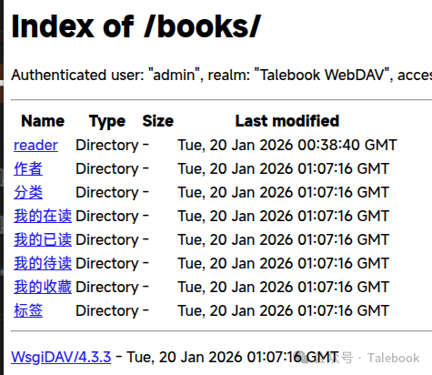

🌐 WebDAV 目录：按作者、分类、阅读状态整理，可直接下载

---

## 第五步：聆听您的书籍

### 将文字转换为有声书

EPUB 书籍详情页 → “有声书”标签页 → “生成有声书”，选择音色，后台逐章转换，支持中断后继续转换。

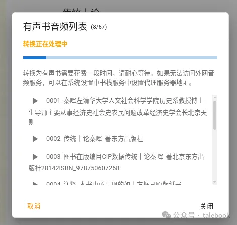

有声书转换

### 播放与管理有声书

生成后可在网页内置播放器收听（调速、定时关闭）；音频文件保存在绑定目录下 `books/audios/`，可导入专业听书软件。

进入有声书标签页，可管理已生成的有声书，包括播放、暂停、调整音量、定时关闭。

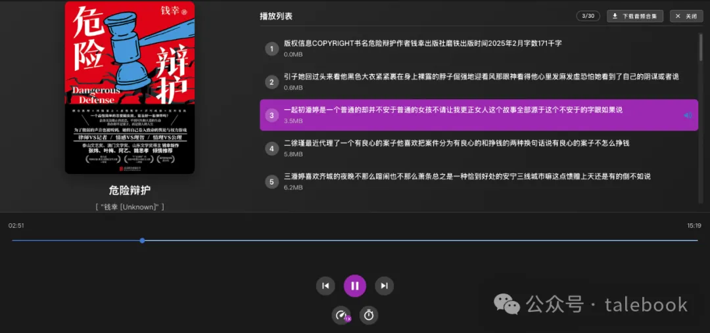

有声书播放

---

## 第六步：用AI赋能书库管理

### 书库内的AI对话助手

配置 DeepSeek API Key 后，首页出现 AI 助手入口，可询问“书库里有多少本书？”“介绍《三体》”。

### 连接外部AI智能体（MCP Server）

MyBooks 可作为 MCP Server，向 Claude Desktop 等提供工具（登录、查询、更新），实现自动化管理。以下是一个连接的json示例：

```
{
  "mcpServers":{
    "MyBooks": {
      "type": "streamableHttp",
      "url": "http://ip:port/api/mcp/stream?token=<分配的token>"
    }
  }
}
```

Token是在系统设置-AI助手中分配。

### 智能分类与书籍推荐

详情页底部根据标签自动推荐相关书籍；结合 AI 生成精准标签后可半自动分类整理。

---

## 第七步：提升阅读体验

### 内置阅读器的增强功能

可选择 Candle Reader（移动优化、章评），支持暗色模式、字体行距调节。

### 管理个人阅读状态与统计

标记“收藏/待读/在读/已读”，用户中心可查看藏书总数、本月在读等。“设为私藏”仅自己可见。

### 个性化界面与交互优化

首页自定义推荐数量、最近显示数量；后台任务状态有动态图标悬浮窗；暗黑模式切换；卡片显示格式图标。

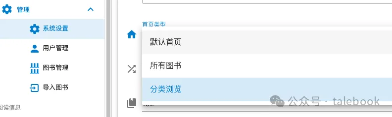

⚙️ 首页自定义：推荐数量/最近显示/首页类型

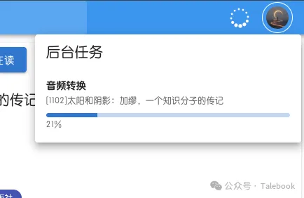

⏳ 后台任务可视化悬浮窗，点击展开进度卡片

---

## 第八步：管理实体藏书

### 添加实体书记录

点击右下角上传按钮旁的“添加实体书”，输入 ISBN（支持扫码）自动从豆瓣获取信息；也可批量 CSV 导入。

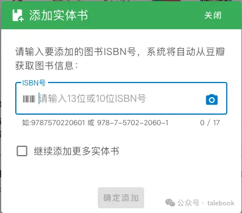

➕ 添加实体书：输入ISBN或扫码，自动获取书名、作者、封面

### 实体书统计

首页统计区分电子书/实体书；在库数量可直接在图书管理表格修改。

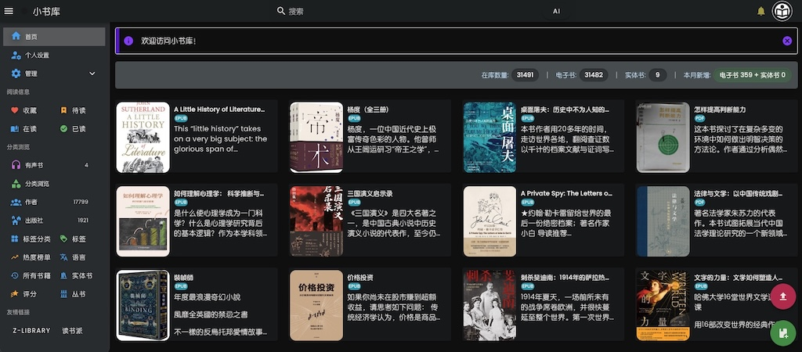

📚 实体书统计：已添加实体书数量

---

## 第九步：系统配置与管理

### 用户账户与权限控制

可添加用户、设置需要激活、控制访客是否可阅读/下载/上传。

### 系统各项参数配置

网站标题、图标、SMTP、高级选项（WebDAV、分片上传、阅读器选择）、CDN 域名、文件权限修复等。

### 日常维护与问题排查

查看绑定目录下 `/log/mybooks.log`；修改设置后可能需要重启容器。

---

## 快速入门与部署指南

### 推荐使用 Docker Compose 部署

```
services:
  mybooks:
    restart: always
    image: poxenstudio/mybooks
    volumes:
      - /mnt/data/books:/data
    ports:
      - "8082:80"
      - "8443:443"
    environment:
      - PUID=990
      - PGID=990
      - TZ=Asia/Shanghai
    depends_on:
      - douban-rs-api
  douban-rs-api:
    restart: always
    image: ghcr.io/cxfksword/douban-api-rs
```

### 五分钟快速上手

1. `docker compose up -d` 启动
2. 访问 `http://IP:8080`，账号 `admin` / `12345678`
3. （可选）复制 Calibre library 到数据目录后重启
4. 放书到 imports 目录，网页端扫描导入
5. 尝试推送到 Kindle 或通过 WebDAV 在阅读器打开

---

### 📬 获取与支持

- 🌐 项目主页：<https://mybooks.top>
- 🐙 GitHub：[PoxenStudio/MyBooks](https://github.com/PoxenStudio/mybooks)
- 💬 问题反馈：GitHub Issues 或公众号“Talebook”

📅 本文档基于 2026年2月22日 内容编制，功能可能随版本更新而变化，请以实际使用为准。

⚡ 搭建您的私有数字图书馆 · 享受阅读自由 · MyBooks 功能手册
